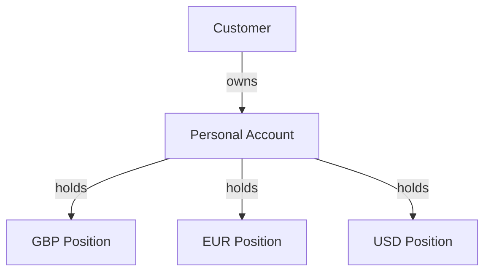

# Product Overview

## Purpose

This project implements a production-oriented backend for a modern financial account and payments platform.

The system is intended to explore financial backend engineering problems beyond ordinary CRUD application development, including:

* multi-currency account management;
* double-entry accounting;
* auditable financial transactions;
* transactional consistency;
* concurrency control;
* idempotent financial operations; and
* reliable transfer processing.

The initial scope focuses on the financial account and ledger domain rather than frontend functionality.

---

## Product Model

A customer owns a personal account capable of holding value in multiple currencies.

Conceptually:



The currencies shown above are examples rather than an exhaustive supported-currency list.

Each currency position represents value denominated in that currency.

Amounts denominated in different currencies are not treated as directly interchangeable. Cross-currency movements will require an explicit foreign-exchange model when FX functionality is introduced.

---

## Multi-Currency Accounts

The platform will use a multi-currency account model rather than restricting each customer to a single currency.

For example, one customer account may simultaneously hold:

* GBP;
* EUR; and
* USD.

This makes the financial model closer to modern fintech account products and introduces meaningful engineering requirements around currency isolation, transfers and future foreign-exchange operations.

The exact persistence model for currency positions has not yet been decided.

---

## Financial Accounting

The platform will use a true double-entry accounting ledger.

Financial movements will therefore not be represented solely by directly modifying a customer balance.

Instead, financial events will be represented as balanced accounting transactions containing debit and credit entries.

For every completed ledger transaction:

```text
Total Debits = Total Credits
```

The ledger is maintained from the perspective of the platform.

Consequently, money owed by the platform to a customer is represented as a liability of the platform.

---

## Initial Scope

The initial development stage focuses on establishing the financial domain and ledger foundation required for later payment functionality.

Planned capabilities include:

* customer account management;
* multiple currency positions;
* internal transfers;
* double-entry ledger posting;
* transaction history;
* idempotent financial operations;
* concurrency-safe processing; and
* integration and concurrency testing.

Some of these capabilities are planned rather than currently implemented.

---

## Out of Scope for the Current Stage

The following areas have not yet been formally designed:

* foreign-exchange execution;
* external bank integrations;
* card processing;
* database schema;
* API contracts;
* transfer state machines;
* concurrency-control strategy;
* idempotency implementation;
* event-driven integration; and
* settlement infrastructure.

These will be documented when their respective architectural decisions are made.
