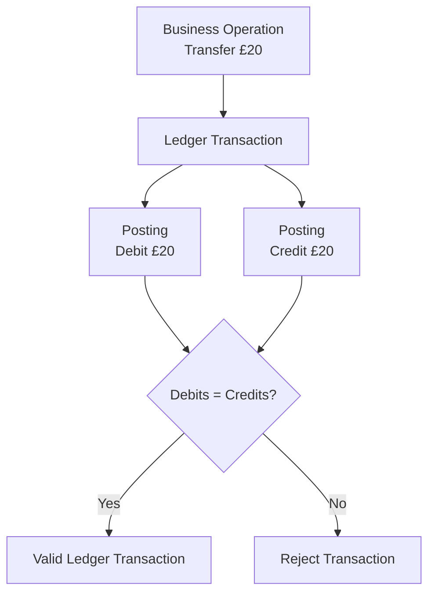

# Ledger Invariants

## Purpose

Ledger invariants define conditions that must remain true regardless of which application operation causes a financial transaction.

These constraints form part of the financial correctness model of the platform.

Implementation mechanisms for enforcing the invariants will be selected during later design stages.

---

# 1. Balanced Transactions

Every ledger transaction must balance.

```text
SUM(DEBITS) = SUM(CREDITS)
```

A transaction for which total debits and total credits differ is invalid and must not become part of the ledger.



---

# 2. Transaction Atomicity

All postings belonging to a single ledger transaction form one financial operation.

The operation must not result in a partially applied accounting transaction.

Conceptually:

```text
ALL postings succeed

or

NO postings succeed
```

For example, an internal transfer must never result in money being removed from the sender's accounting position without the corresponding accounting effect being recorded for the recipient.

The mechanism used to guarantee this property will be determined during persistence design.

---

# 3. Currency Integrity

Monetary amounts must always be associated with a currency.

Amounts denominated in different currencies must not be treated as equivalent simply because their numerical values are equal.

For example:

```text
GBP 100 != EUR 100
```

A same-currency accounting transaction must therefore balance within that currency.

Cross-currency operations will require an explicit foreign-exchange model.

The FX accounting model has not yet been designed.

---

# 4. Platform Accounting Perspective

Ledger entries are interpreted from the accounting perspective of the platform.

Customer-held funds therefore represent liabilities of the platform.

Consequently:

```text
Increase customer liability → CREDIT

Decrease customer liability → DEBIT
```

This interpretation must remain consistent throughout the financial domain.

---

# 5. Financial Movements Must Be Accounted For

A financial movement must have an accounting representation.

Application functionality must not bypass the ledger by independently changing financial state without a corresponding accounting event.

The exact implementation relationship between ledger state and customer-visible balances has not yet been determined.

---

# Future Invariants

Additional invariants are expected to be defined as later design stages are completed.

Likely areas include:

* ledger-entry immutability;
* idempotency;
* duplicate transaction prevention;
* available-balance constraints;
* overdraft behaviour;
* transaction state transitions;
* concurrency behaviour;
* account lifecycle constraints; and
* foreign-exchange conservation rules.

These are intentionally not specified as current invariants until their corresponding architecture has been formally designed.