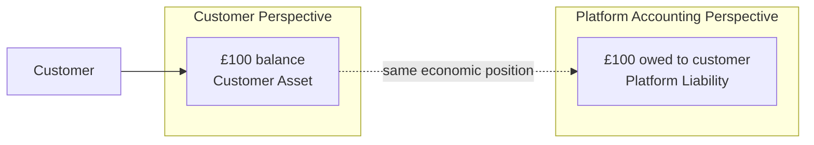
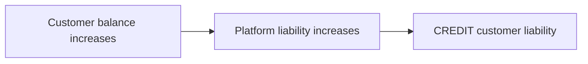
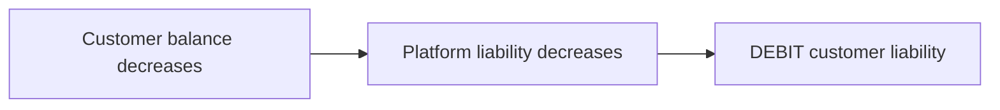
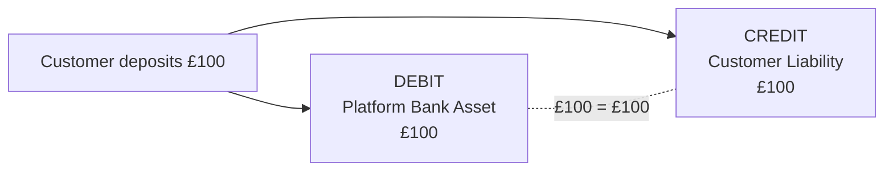
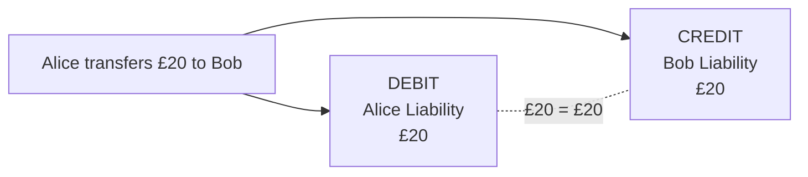

# Ledger Model

## Purpose

The ledger is the authoritative accounting record for financial movements within the platform.

The system uses double-entry accounting and records transactions from the accounting perspective of the platform.

---

# Accounting Perspective

A financial position can appear differently depending on whose books are being considered.

Suppose a customer has £100 held on the platform.

From the customer's perspective, the £100 represents an asset: the customer has a claim against the platform.

From the platform's perspective, the same £100 represents a liability: the platform owes £100 to the customer.



The platform ledger records the **platform accounting perspective**.

Therefore:

> Customer funds held by the platform are liabilities of the platform.

---

# Accounting Account Types

The ledger recognises the standard accounting account classifications:

* Asset;
* Liability;
* Revenue;
* Expense; and
* Equity.

Debit and credit do not inherently mean increase and decrease.

Their effect depends on the accounting account type.

| Account Type | Increase | Decrease |
| ------------ | -------- | -------- |
| Asset        | Debit    | Credit   |
| Expense      | Debit    | Credit   |
| Liability    | Credit   | Debit    |
| Equity       | Credit   | Debit    |
| Revenue      | Credit   | Debit    |

---

# Customer Liability Accounts

Because money held for a customer represents an obligation of the platform, customer balances are represented within the accounting model as liabilities.

Therefore:



Conversely:



This accounting treatment is fundamental to transfer processing.

---

# Double-Entry Accounting

Every financial event must be represented by balanced accounting entries.

The fundamental relationship is:

```text
Total Debits = Total Credits
```

A financial transaction therefore consists of at least two corresponding accounting effects.

A transaction that does not balance is invalid.

---

# Example: Customer Deposit

Suppose a customer deposits £100 into the platform.

Two things happen from the platform's perspective:

1. the platform receives £100, increasing an asset; and
2. the platform now owes the customer £100, increasing a liability.

The journal entry is:

```text
Dr  Platform Bank Asset          £100
Cr  Customer Liability           £100
```

An asset increases through a debit.

A liability increases through a credit.



Therefore:

```text
Total Debits  = £100
Total Credits = £100
```

The transaction balances.

---

# Example: Internal Customer Transfer

Suppose Alice transfers £20 to Bob.

No new money enters or leaves the platform.

Instead, the platform's obligation to Alice decreases while its obligation to Bob increases.

The journal entry is:

```text
Dr  Alice Customer Liability      £20
Cr  Bob Customer Liability        £20
```

The debit reduces the platform's liability to Alice.

The credit increases the platform's liability to Bob.



The platform's total customer liability has not changed.

Only the party to whom the liability is owed has changed.

---

# Ledger Versus Customer-Facing Account

The customer-facing account and the accounting ledger should be treated as distinct concepts.

The customer-facing account represents the financial product exposed to the customer.

The ledger represents the accounting system used to record financial state changes.

A later design stage will establish the exact relationship between:

* customer accounts;
* currency positions;
* ledger accounts;
* ledger transactions; and
* ledger postings.

That relationship has not yet been finalised and is deliberately not specified in this document.

---

# Design Principle

Financial state changes must be represented through accounting transactions rather than arbitrary modifications of monetary balances.

The ledger should therefore become the auditable source of financial truth for the platform.
