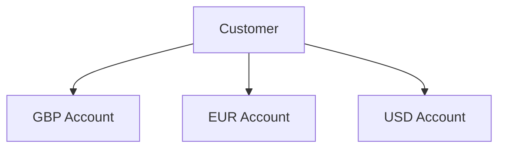
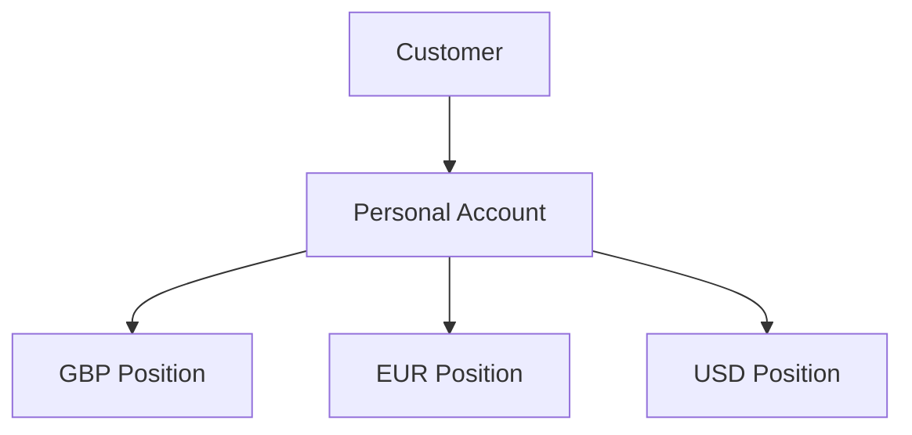

# ADR-001: Adopt a Multi-Currency Customer Account Model

## Status

Accepted

---

## Context

The platform requires a customer account model capable of representing customer-held funds.

During the initial domain-design stage, two broad approaches were considered:

1. restrict an account to a single currency; or
2. allow a customer-facing account to hold multiple independent currency positions.

A single-currency model would reduce implementation complexity because each account would only need to reason about one monetary denomination.

However, the project is intended to model a modern financial platform and explore engineering problems associated with financial infrastructure rather than only implementing a simple account and balance system.

Supporting multiple currencies introduces meaningful domain constraints around:

* monetary representation;
* currency isolation;
* ledger accounting;
* transfers;
* future foreign-exchange operations; and
* reconciliation.

---

## Considered Alternatives

### Option 1 — Single-Currency Accounts

Each financial account would operate in exactly one currency.

Conceptually:



An individual account would therefore have only one associated currency.

### Advantages

* simpler account model;
* simpler transfer validation;
* fewer currency-related domain rules;
* reduced implementation complexity; and
* no ambiguity about the denomination of an account balance.

### Disadvantages

* less representative of modern multi-currency financial products;
* customers require separate product-level accounts for each currency;
* future foreign-exchange functionality becomes less naturally integrated into the customer account model; and
* provides less opportunity to model non-trivial financial-domain constraints.

---

### Option 2 — Multi-Currency Customer Account

A customer-facing personal account can hold multiple independent currency positions.

Conceptually:



Each currency position remains logically separate even though the positions belong to the same customer-facing account.

### Advantages

* more closely resembles modern fintech account products;
* provides a natural foundation for future foreign-exchange functionality;
* allows one customer-facing account to expose several currencies;
* introduces realistic currency-domain constraints;
* allows same-currency and future cross-currency operations to be modelled explicitly; and
* increases the architectural depth of the financial domain.

### Disadvantages

* greater domain-model complexity;
* monetary amounts must always carry currency information;
* balance calculations must remain currency-aware;
* ledger accounts and postings must preserve currency integrity;
* transfers require currency validation; and
* cross-currency movements require an explicit foreign-exchange model.

---

## Decision

The platform will use a **multi-currency customer account model**.

A customer will conceptually own a personal account capable of holding independent positions in multiple currencies.

For example:

```text
Customer
└── Personal Account
    ├── GBP
    ├── EUR
    └── USD
```

Values denominated in different currencies must remain logically separate.

For example:

```text
GBP 100
```

and:

```text
EUR 100
```

must not be treated as equivalent monetary values simply because their numerical amounts are equal.

---

## Rationale

The multi-currency approach was selected because it provides a stronger foundation for the type of financial platform this project is intended to model.

The additional complexity is considered justified because it introduces genuine financial-system concerns rather than artificial application complexity.

In particular, it requires the system to correctly reason about:

* monetary amounts and their currencies;
* currency-specific customer positions;
* currency-specific accounting;
* transfer compatibility;
* financial invariants; and
* future foreign-exchange operations.

The intention is not to introduce complexity solely for portfolio purposes.

Instead, the model provides a realistic foundation on which more advanced financial behaviour can later be implemented.

---

## Consequences

### Positive Consequences

The system can represent customers holding several currencies simultaneously.

Future foreign-exchange functionality can be incorporated without replacing the fundamental customer-account model.

Currency becomes an explicit part of the financial domain rather than an incidental property.

The ledger architecture must account for currency boundaries, providing stronger financial modelling and validation.

The system can distinguish between same-currency transfers and future cross-currency operations.

---

### Negative Consequences

The domain model becomes more complex than a single-currency account system.

Every monetary operation must correctly preserve currency information.

Additional validation will be required to prevent invalid operations between incompatible currencies.

Ledger design must account for currency when determining whether transactions balance.

Foreign-exchange transactions will eventually require additional accounting rules and cannot be modelled as ordinary same-currency transfers.

---

## Architectural Constraints Introduced

This decision establishes several constraints for future design work.

### Monetary Values Are Currency-Aware

Financial amounts must always be associated with a currency.

A numerical amount without an associated currency is insufficient to represent money within the domain.

---

### Currency Positions Are Independent

A customer's GBP position and EUR position represent separate financial positions.

They must not be combined into a single balance without an explicit valuation or conversion operation.

For example:

```text
GBP 100 + EUR 100
```

does not produce a meaningful:

```text
200
```

without first specifying a valuation currency and applicable exchange rates.

---

### Same-Currency Accounting Must Preserve Currency

Ordinary transfers and ledger transactions must not accidentally move value between different currencies.

For example, the following must not be considered a balanced same-currency transaction:

```text
Debit  GBP 100
Credit EUR 100
```

even though the numerical amounts are identical.

---

### Cross-Currency Operations Require Explicit FX Modelling

Moving value between currencies represents a foreign-exchange operation rather than an ordinary transfer.

The accounting and execution model for foreign exchange has not yet been designed.

It will require a separate architectural decision before cross-currency transfers are implemented.

---

## What This Decision Does Not Define

This ADR intentionally does not define the implementation structure for multi-currency accounts.

The following decisions remain open:

* whether a currency position becomes its own domain entity;
* whether each currency position maps one-to-one to a ledger account;
* how currency positions are represented in PostgreSQL;
* whether customer-visible balances are stored, derived or projected;
* how supported currencies are configured;
* how accounts are created when a customer enables a new currency;
* how exchange rates are sourced;
* how foreign-exchange transactions are represented; and
* how cross-currency ledger balancing works.

These decisions will be made during later domain, ledger and persistence design stages.

---

## Relationship to Other Decisions

This decision should be considered alongside:

* **ADR-002 — Use a True Double-Entry Accounting Ledger**

The multi-currency customer model defines the financial product presented to the customer.

The double-entry ledger decision defines how the resulting financial movements are accounted for internally.

The relationship between customer currency positions and internal ledger accounts will be established during the next domain-design stage.
