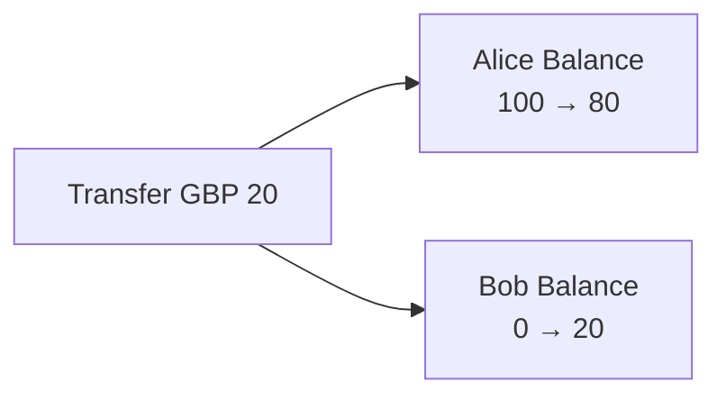
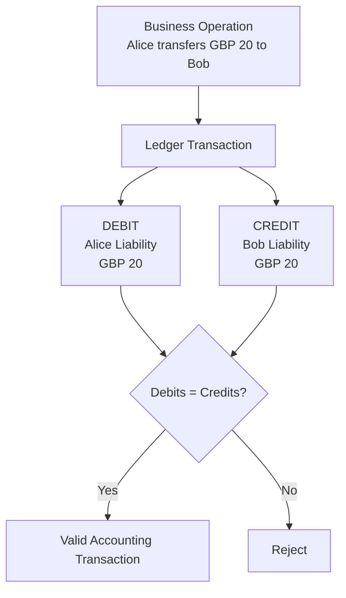
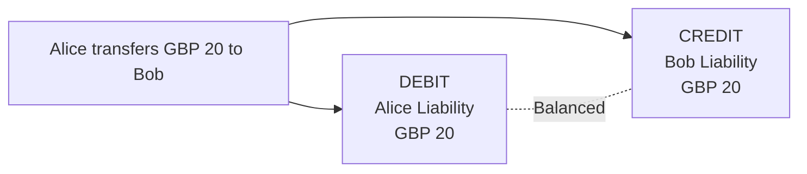

# ADR-002: Use a True Double-Entry Accounting Ledger

## Status

Accepted

---

## Context

The platform requires a reliable way to represent customer-held funds and financial movements such as deposits, withdrawals and internal transfers.

A simple implementation could maintain a mutable balance for each customer currency position.

For example:

```text
Alice GBP balance = 100

Alice transfers GBP 20 to Bob

Alice GBP balance = 80
Bob GBP balance   = 20
```

At implementation level, this could conceptually resemble:

```text
sender.balance -= amount
recipient.balance += amount
```

This approach is straightforward and may be sufficient for simple applications.

However, the platform is intended to model financial infrastructure where financial state changes must be auditable, internally consistent and reconstructable.

A mutable balance alone records the current result but does not naturally provide a complete accounting representation of how that state was reached.

The alternative considered was to represent every financial event through a double-entry accounting ledger.

---

## Considered Alternatives

### Option 1 — Mutable Balance Model

Under this model, each customer currency position would maintain a current balance.

A transfer could conceptually modify two balances:



The application would be responsible for ensuring that both updates occur correctly.

### Advantages

* simple domain model;
* straightforward implementation;
* easy retrieval of current balances;
* fewer accounting concepts;
* reduced initial development complexity.

### Disadvantages

* the current balance alone does not explain how the balance was reached;
* financial history must be maintained separately;
* balance changes may become disconnected from their business cause;
* reconciliation becomes more difficult;
* correcting financial errors can encourage mutation of historical state;
* accounting consistency must be enforced through application-specific logic;
* detecting missing or asymmetric financial movements becomes harder; and
* the model provides limited support for formal accounting guarantees.

---

### Option 2 — Double-Entry Accounting Ledger

Under this model, financial movements are represented as accounting transactions containing balanced debit and credit postings.

For example, if Alice transfers GBP 20 to Bob:

```text
Dr Alice Customer Liability    GBP 20
Cr Bob Customer Liability      GBP 20
```

Conceptually:



Rather than only changing a resulting balance, the system records the financial event that caused the state change.

### Advantages

* every financial movement has an explicit accounting representation;
* transactions can be audited and reconstructed;
* accounting consistency can be expressed through formal invariants;
* reconciliation becomes easier;
* financial errors can be detected through imbalance;
* historical financial activity can remain traceable;
* corrections can later be represented explicitly rather than silently rewriting financial history;
* the model provides a strong foundation for transfers, deposits, withdrawals, fees and foreign exchange; and
* the architecture more closely resembles real financial ledger systems.

### Disadvantages

* substantially greater implementation complexity;
* requires ledger accounts and postings;
* requires understanding debit and credit semantics;
* requires careful transactional boundaries;
* balance retrieval may require additional design;
* concurrency behaviour becomes more important; and
* additional persistence and validation rules are required.

---

## Decision

The platform will use a **true double-entry accounting ledger** as the foundation of its financial accounting model.

Financial movements must be represented through ledger transactions containing corresponding debit and credit postings.

For every valid ledger transaction:

```text
SUM(DEBITS) = SUM(CREDITS)
```

An accounting transaction that does not satisfy this invariant must not be accepted as a valid ledger transaction.

---

## Accounting Perspective

The ledger will be maintained from the accounting perspective of the platform.

This distinction is essential because a customer's balance has a different accounting interpretation depending on perspective.

Suppose a customer has GBP 100 held by the platform.

From the customer's perspective:

```text
GBP 100 claim against platform
        =
Customer Asset
```

From the platform's perspective:

```text
GBP 100 owed to customer
        =
Platform Liability
```

The platform ledger records the second perspective.

Therefore:

> Customer-held funds are liabilities of the platform.

---

## Debit and Credit Behaviour

Debit and credit do not inherently mean increase and decrease.

Their effect depends on the accounting account type.

| Account Type | Increase | Decrease |
| ------------ | -------- | -------- |
| Asset        | Debit    | Credit   |
| Expense      | Debit    | Credit   |
| Liability    | Credit   | Debit    |
| Equity       | Credit   | Debit    |
| Revenue      | Credit   | Debit    |

Because customer funds represent platform liabilities:

```text
Customer balance increases
        ↓
Platform liability increases
        ↓
CREDIT customer liability
```

and:

```text
Customer balance decreases
        ↓
Platform liability decreases
        ↓
DEBIT customer liability
```

This rule must be applied consistently throughout the ledger domain.

---

## Example: Customer Deposit

Suppose GBP 100 enters the platform for a customer.

From the platform's perspective:

1. the platform's cash or bank asset increases by GBP 100; and
2. the amount owed to the customer increases by GBP 100.

The accounting transaction is:

```text
Dr Platform Bank Asset          GBP 100
Cr Customer Liability           GBP 100
```

Conceptually:


The accounting equation remains balanced.

---

## Example: Internal Transfer

Suppose Alice transfers GBP 20 to Bob.

No additional money enters or leaves the platform.

Instead:

* the platform owes Alice GBP 20 less; and
* the platform owes Bob GBP 20 more.

The transaction is:

```text
Dr Alice Customer Liability     GBP 20
Cr Bob Customer Liability       GBP 20
```

Conceptually:



The total amount owed to customers does not change.

Only the party to whom the platform owes the money changes.

---

## Rationale

The double-entry model was selected because the ledger should capture financial events rather than merely preserve their resulting balances.

For a financial platform, the system should be capable of answering both:

```text
How much money does this customer currently hold?
```

and:

```text
Exactly which financial events caused that position?
```

A double-entry ledger provides a natural model for answering the second question while also providing accounting constraints that can be used to verify correctness.

The additional complexity is therefore considered justified.

---

## Consequences

### Positive Consequences

Every financial movement must have an explicit accounting representation.

Financial history can be traced through ledger transactions and postings.

The system gains a formal balancing invariant:

```text
SUM(DEBITS) = SUM(CREDITS)
```

Internal transfers can be represented without inventing artificial money creation or destruction.

Deposits, withdrawals, fees and future foreign-exchange operations can use the same underlying accounting model.

Accounting state can be reconciled against external financial systems in later stages.

The architecture establishes a foundation for stronger financial correctness guarantees.

---

### Negative Consequences

The ledger domain becomes significantly more complex than a standard CRUD balance system.

Developers must correctly understand accounting account types and debit/credit behaviour.

Financial operations require multiple postings rather than simple balance updates.

Persistence operations must preserve transaction atomicity.

The relationship between ledger state and customer-visible balances requires a separate architectural decision.

Concurrency control becomes critical because simultaneous financial operations may affect the same accounts.

Testing must verify financial invariants in addition to ordinary business behaviour.

---

## Architectural Constraints Introduced

### Every Financial Movement Must Have an Accounting Representation

Application functionality must not arbitrarily alter financial state while bypassing the ledger.

A financial movement must correspond to a ledger transaction.

---

### Ledger Transactions Must Balance

For each currency participating in an ordinary same-currency transaction:

```text
SUM(DEBITS) = SUM(CREDITS)
```

Unbalanced accounting transactions must not become part of the valid ledger.

---

### Postings Belong to a Financial Transaction

Individual debit and credit postings are not independent financial operations.

They collectively represent one accounting event.

A later persistence design must therefore ensure that postings belonging to one transaction are committed atomically.

---

### Customer Funds Are Liabilities

Customer-held money must be accounted for as a liability from the platform's perspective.

An increase in the amount owed to a customer requires a credit to the relevant liability account.

A decrease requires a debit.

---

### Currency Must Be Preserved

Double-entry balancing must respect currency boundaries.

The following must not be treated as balanced simply because the numeric values are equal:

```text
Debit  GBP 100
Credit EUR 100
```

Cross-currency accounting requires an explicit foreign-exchange model.

---

## Balance Representation

This decision establishes the ledger as the authoritative accounting record of financial movements.

It does **not yet determine** how customer-visible balances will be represented.

Possible approaches include:

* deriving balances directly from ledger postings;
* maintaining transactional balance snapshots;
* maintaining materialised or projected balances; or
* combining an authoritative ledger with optimised balance representations.

The appropriate approach will be selected during ledger and persistence design.

Regardless of the eventual optimisation strategy, financial balance state must remain reconcilable with the ledger.

---

## Historical Mutation

This ADR does not yet formally establish ledger-entry immutability.

However, the accounting model is intended to preserve an auditable history of financial events.

The rules for:

* modifying posted transactions;
* reversing transactions;
* compensating transactions; and
* correcting accounting errors

will be defined during later ledger lifecycle design.

---

## Transaction Atomicity

A ledger transaction may contain multiple postings.

All postings representing one financial event must eventually be persisted as a single atomic operation.

For example, the platform must never permanently record:

```text
Dr Alice Liability GBP 20
```

without also recording the corresponding:

```text
Cr Bob Liability GBP 20
```

for the same successfully completed internal transfer.

The exact database transaction and concurrency mechanisms used to guarantee this property have not yet been selected.

---

## What This Decision Does Not Define

This ADR intentionally leaves several implementation decisions open.

It does not yet define:

* the Java representation of ledger accounts;
* the Java representation of ledger transactions;
* the Java representation of postings;
* the PostgreSQL schema;
* whether balances are stored, derived or projected;
* ledger-entry immutability rules;
* transaction reversal behaviour;
* account locking;
* database isolation levels;
* optimistic versus pessimistic concurrency control;
* idempotency implementation;
* transaction status models;
* overdraft behaviour;
* pending versus posted balances;
* settlement accounts;
* reconciliation mechanisms; or
* foreign-exchange accounting.

These concerns will be addressed in subsequent architecture decisions as the ledger implementation is designed.

---

## Relationship to Other Decisions

This ADR complements:

* **ADR-001 — Adopt a Multi-Currency Customer Account Model**

ADR-001 defines the customer-facing product model.

This ADR defines the accounting mechanism used to record financial movements created by that product.

The next domain-design stage must establish the relationship between:

```text
Customer
Personal Account
Currency Position
Ledger Account
Ledger Transaction
Posting
```

without conflating the customer-facing account model with the internal accounting model.